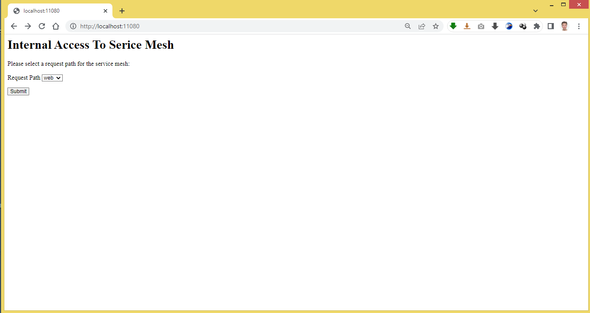

### Entry point to a virtual service in the Istio ambient mesh

The repo provides two options for defining a K8s service as an entry point to an Istio virtual service deployed within an ambient mesh. 
1. By exposing a designated, known pod, say busybox, as a dummy
2. By exposing the backend pods that are the L7 targets of the virtual service

Recall that an entry point to a virtual service is a K8s service specified for the .spec.hosts[0] field in the yaml manifest of the virtual service.
```
apiVersion: networking.istio.io/v1alpha3
kind: VirtualService
metadata:
  name: virtualservice
spec:
  hosts:
    - entry-point
...
```

#### Sample use case

We work with the same use case as the one devised earlier for another repo about [Istio service mesh](https://github.com/snpsuen/Intra-K8s_Access_Istio_Service_Mesh). In essence, it consists in a frontend pod using a virtual service to perform L7 content or traffic switching between different backend services. 
1. Car catalog service
2. Truck catalog service
3. Webapp service
    
#### Option 1

In this option, the entry point is defined to expose a filler pod based on the well known busybox docker. It is a more transparent approach as there is no need to make any change to the K8s manifests of the backend services and workloads. Any attributes or settings related to the waypoint proxy weigh squarely on the filler pod of the entry point and nothing else. Nevertheless the downside is, the filler pod requires allocation of additional resources from the K8s cluster.

##### Deployment procedure

Assume you have read through the [quickstart guide](https://istio.io/latest/docs/ops/ambient/getting-started/) to set up an ambient mesh on a K8s cluster.

1.  Deploy the backend workloads and services.
```
kubectl apply -f https://raw.githubusercontent.com/snpsuen/Istio_Ambient_Mesh/main/Option01/manifests/car-truck-catalog-deployment-service.yaml
kubectl apply -f https://raw.githubusercontent.com/snpsuen/Istio_Ambient_Mesh/main/Option01/manifests/webapp-deployment-v4041-service.yaml
```
2.  Deploy the frontend pod and service.
```
kubectl apply -f https://github.com/snpsuen/Istio_Ambient_Mesh/raw/main/Option01/manifests/meshfront-deployment-service.yaml
```
3.  Deploy the entry point pod and service based on the busybox docker.

The manifest of a service account named service-mesh is also defined in the same yaml file so that the entry point pod is assigned to it therein.
```
kubectl apply -f https://github.com/snpsuen/Istio_Ambient_Mesh/raw/main/Option01/manifests/service-mesh-deployment-service.yaml
```
4.  Deploy the virtual service together with the destination rule for the webapp service.
```
kubectl apply -f https://github.com/snpsuen/Istio_Ambient_Mesh/raw/main/Option01/manifests/destination-rule-v4041.yaml
```
5.  Set up a wayproxy to apply to the service-mesh service account.
```
istioctl x waypoint delete --service-account service-mesh
```
#### Option 2 

In this option, the entry point is defined to expose the backend pods through a new label, group: service-mesh. To adapt to the ambient mesh, the declarative state of the backend workloads needs to be adjusted in the following aspects.
1. Assigned to a new service account named service-mesh.
2. Marked with a second label, group: service, to map to the entry point service.

Unlike Option 1, it does not incur allocation of additional resources from the K8s cluster.

##### Deployment procedure

1.  Deploy the backend workloads and services together with the service account concerned.
```
kubectl apply -f https://raw.githubusercontent.com/snpsuen/Istio_Ambient_Mesh/main/Option02/manifests/car-truck-catalog-deployment-service.yaml
kubectl apply -f https://raw.githubusercontent.com/snpsuen/Istio_Ambient_Mesh/main/Option02/manifests/webapp-deployment-v4041-service.yaml
```
2.  Deploy the frontend pod and service.
```
kubectl apply -f https://github.com/snpsuen/Istio_Ambient_Mesh/raw/main/Option02/manifests/meshfront-deployment-service.yaml
```
3.  Deploy the entry point service that expose the backend pods as fillers.
```
kubectl apply -f https://github.com/snpsuen/Istio_Ambient_Mesh/raw/main/Option02/manifests/service-mesh-service.yaml
```
4.  Deploy the virtual service together with the destination rule for the webapp service.
```
kubectl apply -f https://github.com/snpsuen/Istio_Ambient_Mesh/raw/main/Option02/manifests/destination-rule-v4041.yaml
```
5.  Set up a wayproxy to apply to the service-mesh service account.
```
istioctl x waypoint delete --service-account service-mesh
```

### Test it out

Land in the home page (index.html) on meshfront-service via the given load balancing VIP or node port of one of the K8s hosts, and select a backend service to access. You may need to set up a NAT port forwarding chain to map a port of your desktop to the appropriate listener port of the entry point service.



Alternatively, use curl on a K8s host to generate POST traffic repetively to meshfront-service via the given node port.
~~~
while true
do
  curl -X POST -F 'path=web' http://localhost:<NodePort>/accessmesh
  echo ""
  curl -X POST -F 'path=car' http://localhost:<NodePort>/accessmesh | grep car
  curl -X POST -F 'path=truck' http://localhost:<NodePort>/accessmesh | grep truck
  sleep 3
done
~~~


